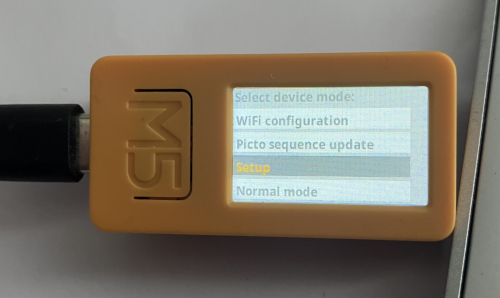
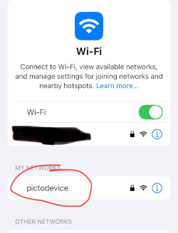
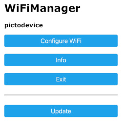
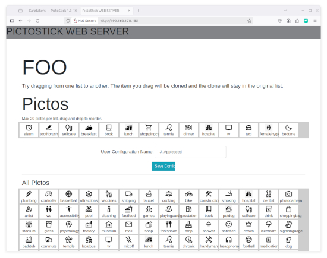

.. _caretakers:

==========
Caretakers
==========

.. note::
   **Intended Audience**
   This documentent is intended for Caretakers, Health Professionals and
   Parents of users of the PictoStick.

As a caretaker, you will be able to configure some of the more high-level functions
of the PictoStick for the user. The PictoStick configuration menu can be opened by
long-pressing (about 5 seconds) button B. In the image below button B is located on
the bottom side of the device (when held lengthwise).

In order to configure the device, the device can be placed in any of four 'device modes',
namely:

#. **WiFi configuration** mode
#. **Picto sequence update** mode
#. **Setup** mode
#. **Normal mode** (default)

WiFi configuration mode
=======================

In this mode we will configure the
device (once only) to connect to your local WiFi network. This will
enable the device to sync the correct time via the NTP-network
protocol automatically and prepare the device for future configuration
in **Picto sequence update** mode (see below).
You will need a mobile telephone  or computer connected to
your local WiFi network. Keep your wifi SSID and password handy.

On your phone or computer go to the WiFi network settings and connect to
WiFi network labeled 'pictodevice'.

Still on the phone or computer you will be presented with the WiFiManager
screen and you can select the 'Configure WiFi' menu option to configure the
PictoStick device to connect to your local WiFi network. This you will need
to do only once.

After this the device will boot in normal mode. In normal mode for everyday
use the device will *not* use the configured WiFi connection by default to
conserve battery power. It will have stored the network credentials for when needed
as well as the correct time which is stored in the RTC clock on the PictoStick
device.

Picto sequence update mode
==========================

Select **Picto sequence update** to enter Picto sequence update mode. In this mode
you are able to edit the sequence of picto's, add or remove picto's from the
User sequence directly on this device, via a web interface on your computer or
a mobile device.

After entering this mode, the PictoStick device will start WiFi (provided it is
configured in the WiFi configuration mode described above), and start a web server
on the device. The PictoStick device screen will display the IP-address on which the
device can be connected. Type the ip-address in a browser window on a computer or
mobile device in the same WiFi network to connect.

Since all the pictos are stored locally on the device it may take one
or two minutes to load all the picto images in the web interface.
Once this process is complete you are able to update the picto sequence on the top half
of your screen, marked **Pictos**. You can drag and drop to re-order, add and delete pictos from the
sequence. The lower half of the screen holds all the pictos that are loaded on the
device and you can select any of the to use in the sequence (max 20).

Once you are happy with the sequence of pictos you have selected, enter the name
of the user in the form field and press the blue button to save the configuration
on to the PictoStick Device. The device will then proceed to boot into regular mode.

Setup mode
==========

Select **Setup** to enter Setup mode. In this mode you are able to adjust the
time (hours, minutes and seconds), brightness and buzzer on/off. Use button A to
exit this mode and return to normal mode.

Normal mode
===========

Select **Normal mode** to enter Normal mode. This is the default mode for this device.
