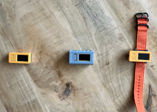

.. _introduction:

============
Introduction
============

Care givers, parents and health care professionals of people with a mental disability and/or an Autism spectrum disorder (ASD), or previously referred to as 'autism', often make use of visual pictograms to give people a clearer understanding of the world around them.

One of the biggest advantages of using pictograms (or pictos) is that in one easy to grasp visual form the activities and their sequence that are planned for the day ahead are presented. This provides understanding and prevents stress and miscommunication.

Often the pictos are presented on a board on the wall or simply on a wooden plank on which the pictos are added (or even removed during the day) showing the activities and the order in which these take place. While this low tech way often works fine in practice it is not portable and often only used in either the users' household or the (work) places during the day.

The pictostick offers a method to present a scrollable sequence of pictos for the user in a portable way, either as a small device that can be carried around or a watch-like option with a wrist band. The pictostick can be referred to by the user as to the daily activities and even to check off the ones that have already been completed.

Key features
************

.. _requirements:

Requirements
************

Hardware
--------
* M5 StickC Plus2, a low-cost, small form factor ESP32 Mini IoT Development Kit.
  It has a 1.14-inch TFT screen with a resolution of 135x240 pixels and a battery capacity of 200mAh.
  (https://shop.m5stack.com/products/m5stickc-plus2-esp32-mini-iot-development-kit)
* M5-Watch wristband for M5 StickC Plus2 (optional)

Software
--------
The code for the pictostick is Free/Open Source software made available under the Creative Commons Zero v1.0 Universal License at https://github.com/jsoeterbroek/pictostick Github repository.

License
*******

The Pictostick project is licensed under the 'Creative Commons Zero v1.0 Universal' license.
The picto icons used are Google Fonts Material Design icons, made available under the Apache License Version 2.0 license.
