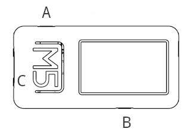

.. _howto_use:

=========================
How to use the PictoStick
=========================

.. note::
   **Intended Audience**
   This documentent is intended for PictoStick everyday users. It also
   holds relevant information for Caretakers, Health Professionals and
   Parents of users.

Introduction
============
This document will show you how to use the PictoStick. This device
will be pre-configured for your use and will show you your activities
for the day (or week) in the correct order.
Every activity is displayed on the screen with a picto  and a small
text describing the activity.

The Buttons
===========
The PictoStick has three buttons that you can use. They are shown in the
image below:

Button A is located on the side of the Pictostick. It can be used to navigate.
This button is also the main power button.
Button B is located on the other side of the Pictostick. It can be used to navigate.
Button C is the big button on top, marked M5. It can be used to mark an activity as
done.

Powering On
===========
When the screen is black, the pictostick is either turned of completely
or has gone in powersaving mode to conserve battery power. Most likely
it is in powersaving mode and not turned off completely unless you have
done so deliberately.

To turn the PictoStick on from powersaving mode, you can shortpress button A.
To turn the Pictostick on when it is completely turned off, you can
longpress button A.

.. note::
   'shortpress' means holding the button for about one second. 'longpress' means
   holding the button for a few seconds longer.

The Screen
==========
On the bottom of the screen you will see a row of little circles. The number of circles
shows you how many activities there are scheduled for you today. An orange color
means the activity has not been marked done yet. A green color means the activity is
marked done. Preferably at the end of the day, you will have marked all orange color
circles to green.

On the left you will see a picto (pictogram) of the activity and on the right side you
can see a label with a short description of the picto. Above this you will see the current
day of the week and the current time in hours and minutes. Above this is a label with your
name. In the top right corner you will see a small icon of a battery showing you how
much battery power you have left before recharging.

TBA
